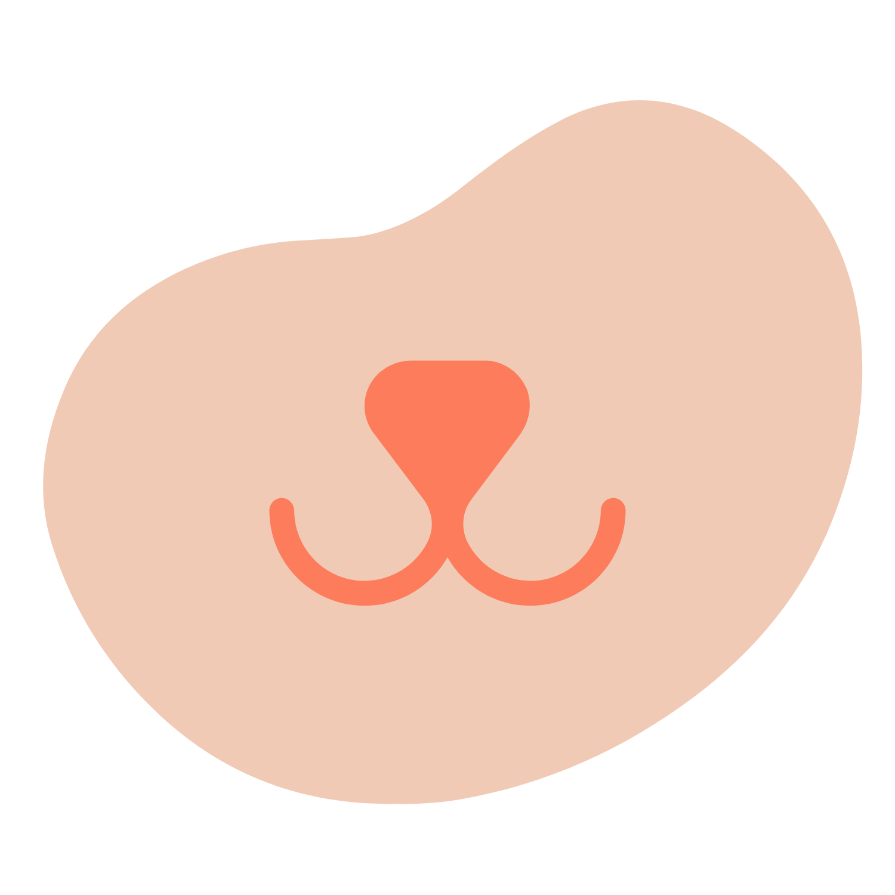

<h1 align="center">
    
</h1>

<h3 align="center">Animalia: Gestão animal</h3>

  <a href="#-instalação-e-execução">Instalação e execução</a>&nbsp;&nbsp;&nbsp;|&nbsp;&nbsp;&nbsp;
    <a href="#-funcionamento">Funcionamento</a>&nbsp;&nbsp;&nbsp;|&nbsp;&nbsp;&nbsp;
  <a href="#-objetivos">Objetivos</a>

 

  

## 🛠️ Instalação e execução

1. Tenha o React Native e o React Native CLI instalados;
2. Faça um clone desse repositório;
3. Pelo terminal, rode `yarn` para instalar as dependências;
4. Pelo terminal, rode `npx react-native start` para inicializar a Metro Bundler;
5. Pelo terminal, rode `npx react-native run-android` para inicializar o aplicativo no emulador ou dispositivo conectado ao Metro.

## 🚀 Funcionamento

O aplicativo conta com funções de listagem, cadastro, edição e deleção de pets. A aplicação foi feita em React Native, utilizando SQLite para armazenamento dos dados.

### 🏠 Home

`Home` - Lista de pets cadastrados, contando com nome, raça, gênero, idade e foto do pet.

### ✏️ Cadastrar

`Cadastrar` - Página para cadastro de novos pets, utilizando `react-native-image-picker` para a seleção de imagens. Atualmente, as fotos dos pets são salvas no banco de dados em base64 (não ideal). Isso será atualizado no futuro para melhor desempenho do aplicativo.

### 🖋️ Editar

`Editar` - Página contando com opções de edição e deleção para cada pet.

## 💻 Objetivos

Esse aplicativo foi feito como atividade na matéria Projeto Integrador Mobile, no Curso Técnico de Informática para Internet da instituição Senac. O objetivo é servir como exercício dos conteúdos ensinados.

---

Feito com ♥ by Sofia Rodrigues Ferreira :wave: <a href="https://www.linkedin.com/in/sofiarodfer/">Contato</a>

